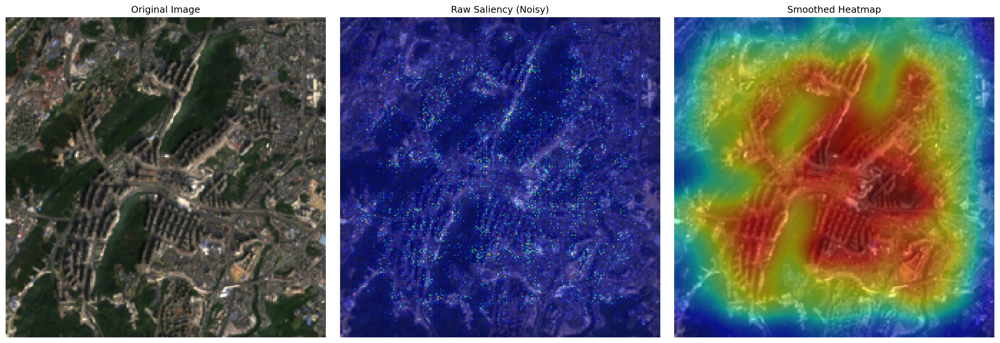

# AI for Sustainable Development: Poverty Prediction from Satellite Imagery

> **Coursework 2 Submission** | UCL
> **Student:** [Jiaming Wei/25090843]
> **Module:** AI for Sustainable Development

## 📌 Project Overview

This project replicates and extends the seminal paper *"Combining satellite imagery and machine learning to predict poverty"* (Jean et al., 2016). It adapts the methodology to a new geographic context—**Guizhou, China**—to address the unique challenges of poverty estimation in complex Karst topography.

The core innovation involves upgrading the model architecture from VGG-F to **ResNet-18** and implementing a **Zero-Shot Transfer Learning** pipeline to validate the model's generalizability across continents (Africa → China) without retraining on local nightlights.

## 🖼️ Model Explainability: Visualizing Poverty Features

*Below: Saliency Map generated by our ResNet-18 model on the **Guiyang Huaguoyuan ("White House")** area. The heatmap (right) demonstrates the model's ability to ignore natural background noise (blue) and focus precisely on high-density built-up structures (red).*



*(Source: Author generated using custom `visualize_saliency.py` script)*

## 🛠️ Key Features & Contributions

### 1\. Methodology Adaptation (Architecture)

  * **ResNet-18 Backbone:** Replaced the legacy VGG-F with a custom **TensorFlow 1.15 implementation of ResNet-18** (`models/models_resnet.py`).
  * **Strong Regularization:** Implemented **Dropout (rate=0.5)**, **L2 Regularization**, and **Strong Augmentation** (Rotation/Color Jitter) to combat overfitting on the small dataset (N=3136).
  * **Early Stopping:** Integrated validation monitoring to prevent overfitting, achieving a best validation $R^2$ of **0.5925**.

### 2\. Data Curation (New Context: Guizhou, China)

  * **Custom Dataset:** Curated a dataset of 20 locations in Guizhou, specifically designed to test model robustness against:
      * **Adversarial Samples:** Relocation villages (e.g., *Huawu*) that visually mimic wealthy suburbs.
      * **Invisible Poverty:** Cave dwellings (e.g., *Zhongdong*) invisible to optical satellites.
  * **Ground Truth Verification:** Performed manual geospatial audits to correct coordinate shifts (e.g., *Caowangba*), reducing false positive rates significantly.

### 3\. Technical Implementation

  * **Reproducible Pipeline:** Fully Dockerized environment (`Dockerfile`) ensuring consistent execution of legacy TensorFlow 1.15 code.
  * **Automated Data Processing:** Scripts for resolving ID collisions in DHS data (`process_dhs_data.py`) and robust satellite image downloading (`download_africa_images.py`).

## 💻 Installation & Setup

This project uses a **Dockerized environment** to manage dependencies (TensorFlow 1.15, Python 3.7).

### Option A: Using Docker (Recommended)

```bash
# 1. Clone the repository
git clone https://github.com/Quarkgluonmixture/africa_china_poverty.git
cd africa_china_poverty

# 2. Build the image
docker build -t poverty-resnet .

# 3. Run the container
docker run --gpus all -it poverty-resnet
```

### Option B: Local Conda Environment

```bash
# 1. Create environment from config
conda env create -f env.yml
conda activate poverty_env

# 2. Authenticate Google Earth Engine
earthengine authenticate
```

## 🚀 How to Run the Experiments

### 1\. Data Preparation (Africa)

Extract DHS data, resolve cluster ID conflicts, and download satellite imagery.

```bash
python process_dhs_data.py       # Cleans survey data
python download_africa_images.py # Downloads 3000+ images from GEE
```

### 2\. Train the Model (Africa Baseline)

Train the ResNet-18 model on African data with the optimized hyperparameters (Exp-05).

```bash
python train_model.py --learning_rate 1e-4 --batch_size 32
```

*Output: Saves the best model weights to `checkpoints/best_model.ckpt`.*

### 3\. Transfer Inference (China Context)

Apply the trained African model to the Guizhou dataset to test generalization.

```bash
# Ensure China images are in data/images/
python predict_china.py
```

*Output: Generates `china_predictions.csv` with predicted wealth indices.*

### 4\. Generate Visualizations

Create Saliency Maps and performance plots for the report.

```bash
python visualize_saliency.py     # Generates heatmaps
python generate_final_figures.py # Generates training curves and bar charts
```

-----

*Note: This repository is for academic assessment purposes. All satellite imagery is sourced from Sentinel-2 via Google Earth Engine.*