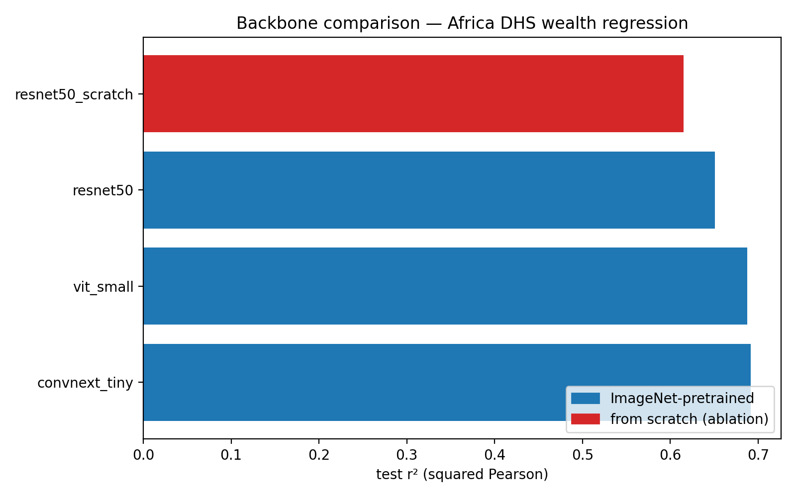
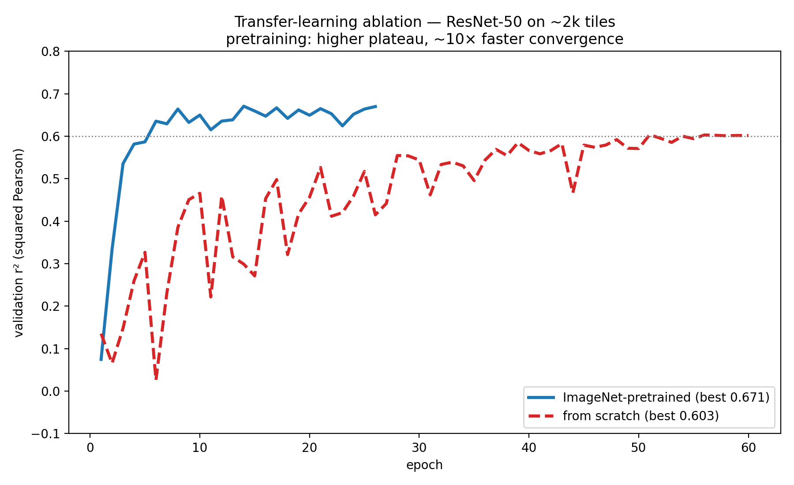
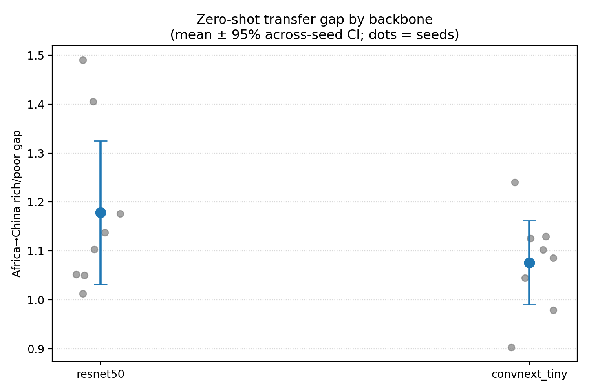
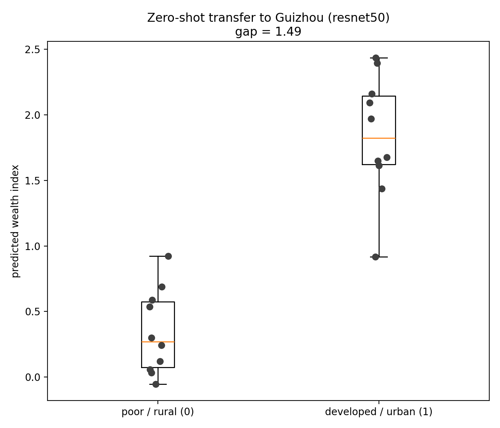
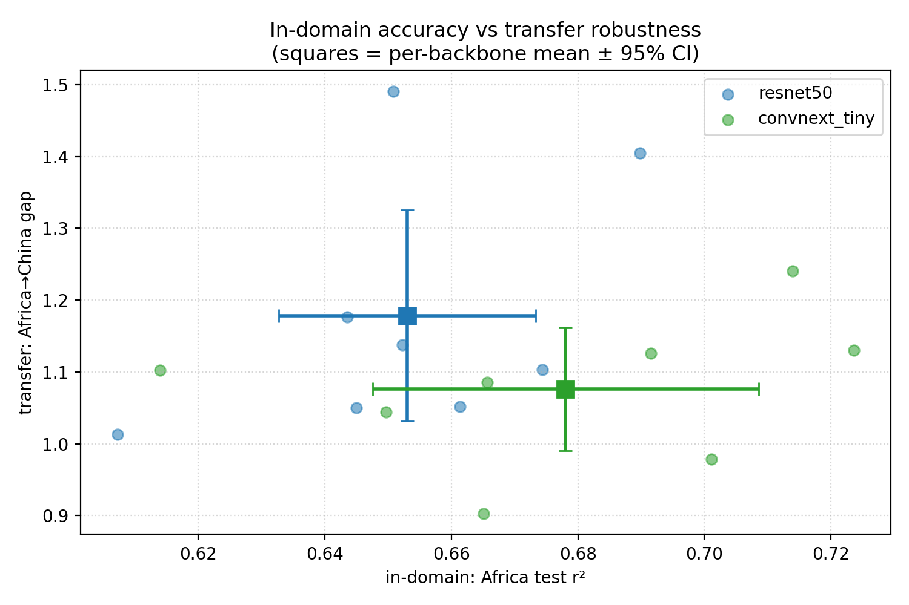
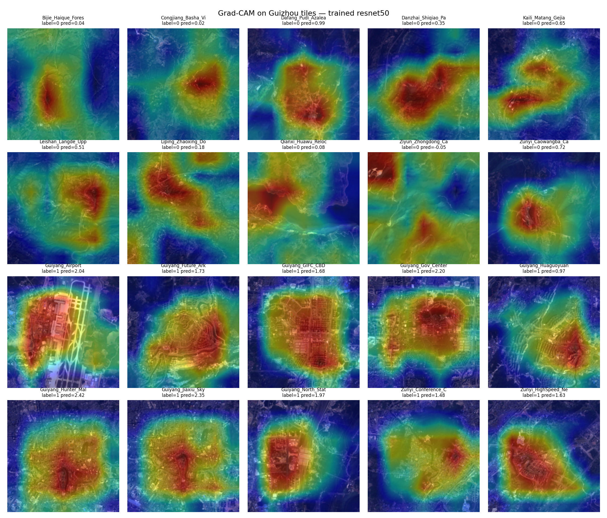
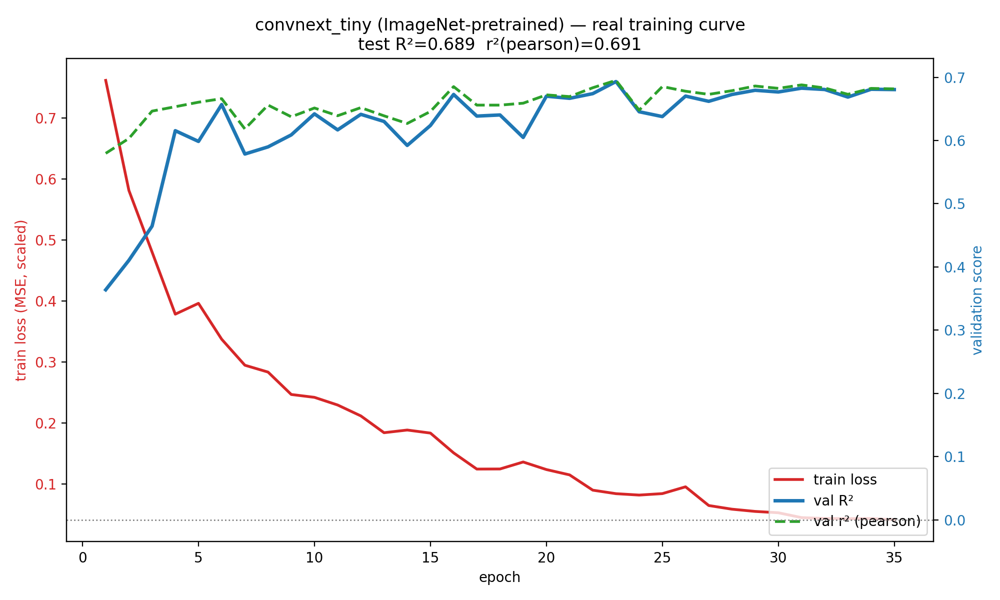

# Satellite Poverty Mapping & Cross-Continent Transfer

**Predicting local economic well-being from RGB satellite imagery with
ImageNet-pretrained CNNs/transformers — and testing whether a model trained only
on Africa can be transferred *zero-shot* to rural China.**


A deep-learning study that regresses a continuous **wealth index** from
Sentinel-2 tiles over five African countries, compares three modern backbones,
isolates the effect of transfer learning with an ablation, and then probes
**out-of-distribution generalization** on a purpose-built, adversarial dataset
of 20 locations in **Guizhou, China**. Built as a PyTorch reimplementation and
extension of Yeh et al. (2020, *Nature Communications*); see
[ATTRIBUTION.md](ATTRIBUTION.md).

---

## Results at a glance

| Backbone | Pretraining | Test R² | Test r² (Pearson) | RMSE |
|---|---|---:|---:|---:|
| ResNet-50 | from scratch (ablation) | 0.614 | 0.615 | 0.560 |
| ResNet-50 | ImageNet | 0.650 | 0.651 | 0.534 |
| ViT-S/16 | ImageNet | 0.683 | 0.687 | 0.507 |
| **ConvNeXt-Tiny** | ImageNet | **0.689** | **0.692** | **0.503** |

*In-country split, held-out test set. Reproduce with `bash scripts/run_all.sh`.*



**Two headline findings**

1. **Transfer learning helps — most visibly in convergence.** With only ~2k
   labelled tiles, an ImageNet-pretrained ResNet-50 reaches its best by epoch 14
   and tops out at test r²=**0.65**; the *same* architecture from scratch only
   gets there around epoch 51 and lands a little lower (**0.615**). So the
   final-accuracy gap is modest (+0.04 r²) — the real win is much faster, more
   stable convergence (see the ablation curve). From-scratch is not a failure
   here; pretraining is just a clearly better use of the same data.

   
2. **Africa→China zero-shot transfer is robust — and architecture-insensitive.**
   Tested over **8 paired seeds** + a stratified bootstrap on the 20 Guizhou
   tiles, both backbones produce a clearly positive developed/poor gap with *no*
   fine-tuning (ResNet-50 **1.18**, 95% CI [1.03, 1.33]; ConvNeXt **1.08**, [0.99,
   1.16]; bootstrap lower bounds ≈0.78 — well clear of 0). ConvNeXt is
   *significantly* better in-domain (paired Δr²=+0.025, p=0.003, 8/8 seeds), but
   that edge does **not** carry to transfer (paired Δgap 95% CI [−0.05, +0.25],
   includes 0). A single seed had hinted ResNet-50 transferred better (1.49 vs
   1.13) — replication showed that was a seed artifact, not a real effect.

   

---

## Africa → China zero-shot transfer

The model never sees a Chinese label. The 20 Guizhou tiles
([`china/china_coordinates.csv`](china/china_coordinates.csv)) are deliberately
adversarial — they target the failure modes of optical poverty mapping.
Representative per-tile predictions (one model; the *quantitative* claim is the
multi-seed gap above):

| Location | Truth | Pred | Why it is hard |
|---|---|---:|---|
| Ziyun Zhongdong **cave dwelling** | poor | **−0.05** | poverty literally invisible to optical satellites → still ranked lowest |
| Qianxi Huawu **relocation site** | poor | **0.12** | white-walled resettlement that mimics a wealthy suburb → not fooled |
| Guiyang Huaguoyuan "**White House**" | developed | **0.92** | ultra-dense vernacular housing the model *under-rates* → honest failure case |
| Guiyang Hunter Mall / Jiaxiu skyline | developed | **≈2.4** | dense built-up urban core → ranked highest |



Whether the in-domain ranking carries over to transfer is tested directly across
seeds — the in-domain advantage does **not** translate into a transfer advantage:



### Interpretability — Grad-CAM on a trained model

Gradient-weighted class activation maps w.r.t. the scalar wealth prediction. On
urban tiles the attention concentrates on built-up structures (the airport
terminal, CBD towers, the government complex); on rural tiles it is diffuse —
evidence the network keys on man-made density rather than terrain.



---

## Method

```
Sentinel-2 RGB tile ─▶ ImageNet-pretrained backbone (timm) ─▶ linear head ─▶ wealth index (ŷ)
                         resnet50 / convnext_tiny / vit_small
```

- **Task.** Single-output regression of the DHS asset-based wealth index;
  optimised with MSE on a standardised target, all metrics reported back in
  original units.
- **Data.** ~2k geolocated clusters across Nigeria, Malawi, Rwanda, Uganda,
  Tanzania; ImageNet-style augmentation (random resized crop, flips, colour
  jitter).
- **Evaluation.** Country-stratified in-country split, plus an optional
  **leave-one-country-out** protocol (`--split country_holdout`) for true
  out-of-country generalization. Metrics: R², squared Pearson r² (the metric
  used by the source paper), RMSE, MAE.
- **Training.** AdamW + cosine schedule with linear warm-up, bf16 mixed
  precision, early stopping on validation r²; fully seeded.


- **Compute.** Trained on an NVIDIA **GB10 (Grace-Blackwell, ARM64)** with a
  PyTorch cu128 build; a UCL Myriad (SGE) batch script is included.

---

## Repository layout

```
src/acp/             # library
  data.py            #   DHS dataset, country-stratified / leave-one-country-out splits, transforms
  models.py          #   timm backbone factory + regression head
  engine.py          #   train/eval loops, metrics, AMP, early stopping
  gradcam.py         #   Grad-CAM for the regression head
  utils.py           #   seeding, device, AMP dtype, target scaler
configs/             # one YAML per experiment (resnet50 / convnext_tiny / vit_small / resnet50_scratch)
scripts/
  train.py           # train + evaluate one config -> outputs/<run>/
  predict_china.py   # Africa-trained model -> 20 Guizhou tiles (zero-shot)
  gradcam_china.py   # Grad-CAM overlays for the Guizhou tiles
  compare_models.py  # aggregate test metrics -> comparison table + plot
  plot_history.py    # re-plot a run's curve from history.csv
  run_all.sh         # train all backbones + ablation, then compare
  qsub_myriad.sh     # UCL Myriad (SGE) batch job
  data_prep/         # Google Earth Engine download + DHS cleaning
china/               # Guizhou coordinates + dataset-construction report
reports/figures/     # committed figures used in this README
```

Data, checkpoints and per-run `outputs/` are git-ignored.

## Setup

```bash
conda env create -f environment.yml && conda activate acp
# Install the PyTorch build matching your GPU (see requirements.txt). On the
# NVIDIA GB10 (Blackwell, ARM64) this was developed on:
pip install torch torchvision --index-url https://download.pytorch.org/whl/cu128
pip install -r requirements.txt
```

**Data.** `data/clusters.csv` (`unique_id, cluster_id, wealth_index, LATNUM,
LONGNUM, country`) + `data/images/{unique_id}.jpg`; the 20 Guizhou tiles in
`china_dataset_final/`. Download/cleaning utilities live in `scripts/data_prep/`.

## Reproduce

```bash
python scripts/smoke_test.py                                   # ~30s end-to-end sanity check
bash scripts/run_all.sh                                        # train backbones + ablation, then compare
python scripts/predict_china.py --ckpt outputs/resnet50/best.pt --backbone resnet50
python scripts/gradcam_china.py  --ckpt outputs/resnet50/best.pt --backbone resnet50
# True out-of-country generalization (train on 4 countries, test on the 5th):
python scripts/train.py --config configs/resnet50.yaml --split country_holdout --holdout-country NG
# Multi-seed transfer study + statistics (8 paired seeds, bootstrap CIs):
bash scripts/seed_study.sh && python scripts/analyze_seed_study.py
```

## Pretrained checkpoints

Download the trained weights from the [**v1.0 release**](https://github.com/Quarkgluonmixture/africa_china_poverty/releases/tag/v1.0):

| Checkpoint | Backbone | Test r² | Download |
|---|---|---:|---|
| ConvNeXt-Tiny | best model | **0.692** | [`convnext_tiny.pt`](https://github.com/Quarkgluonmixture/africa_china_poverty/releases/download/v1.0/convnext_tiny.pt) (107 MB) |
| ViT-S/16 | — | 0.687 | [`vit_small.pt`](https://github.com/Quarkgluonmixture/africa_china_poverty/releases/download/v1.0/vit_small.pt) (83 MB) |
| ResNet-50 | used in China demos | 0.651 | [`resnet50.pt`](https://github.com/Quarkgluonmixture/africa_china_poverty/releases/download/v1.0/resnet50.pt) (90 MB) |

Each `.pt` bundles the `state_dict`, training metadata and the target `scaler`
(`mean`/`std`); checksums in [`SHA256SUMS.txt`](https://github.com/Quarkgluonmixture/africa_china_poverty/releases/download/v1.0/SHA256SUMS.txt).

```bash
# example: zero-shot China inference with the best model, no training needed
curl -L -o convnext_tiny.pt \
  https://github.com/Quarkgluonmixture/africa_china_poverty/releases/download/v1.0/convnext_tiny.pt
python scripts/predict_china.py --ckpt convnext_tiny.pt --backbone convnext_tiny
```

```python
import torch
from acp.models import build_model        # src/acp on PYTHONPATH
from acp.utils import TargetScaler

ck = torch.load("convnext_tiny.pt", map_location="cpu", weights_only=False)
model = build_model("convnext_tiny", pretrained=False)
model.load_state_dict(ck["model"]); model.eval()
scaler = TargetScaler(**ck["scaler"])     # scaler.inverse(pred) -> wealth index
```

---

## Skills demonstrated

**Research:** experimental design & ablation, **statistical rigor** (multi-seed
paired tests, t- and bootstrap CIs, replicating a suggestive single-seed result
and reporting that it did not hold), cross-domain / zero-shot generalization,
model interpretability (Grad-CAM), adversarial dataset construction.
**ML engineering:** PyTorch + timm, modern training (AdamW/cosine/AMP/early
stopping), reproducible config-driven experiments, multi-architecture
benchmarking, GPU/HPC workflows (Blackwell, SGE/qsub).
**Domain:** remote sensing, satellite imagery, socioeconomic prediction for
sustainable-development applications.

## License & attribution

MIT (see [LICENSE](LICENSE)). Built on the `africa_poverty` research code
(© 2022 Christopher Yeh); the PyTorch rebuild and the China transfer study are
by Jiaming Wei. Full provenance in [ATTRIBUTION.md](ATTRIBUTION.md).
